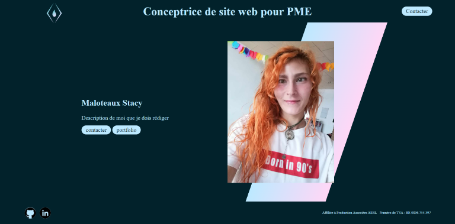

# V-card
***
Le projet "V-cad" est une ébauche statique d'une carte de visite en ligne.

## Table des matières
1. [Utilisation](#utilisation)
2. [Technologies](#technologies)
3. [Captures d'écran](#captures-décran)
4. [Améliorations futures](#ameliorations-futures)

### Utilisation
***
Pour voir la v-card, :

1. Allez sur la page [v-card](https://tess-mltx.github.io/V-card/)

### Captures d'écran
***

## Technologies
***
Liste des technologies utilisées dans le projet :
* CSS

## Améliorations futures
***
* Ajouter le l'interactivité.
* Améliorer le design.